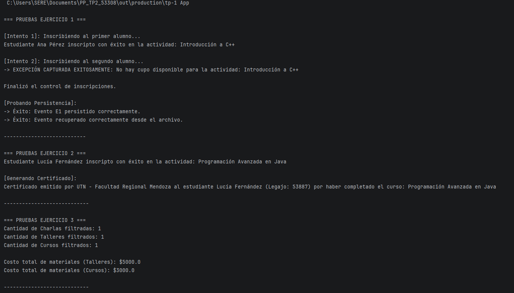
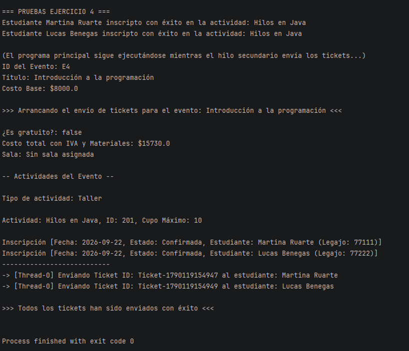

# Trabajo Práctico N° 2 - Paradigmas de Programación
**Alumna:** Serena Bosio

**Legajo:** 53308

## Descripción del Proyecto
El programa permite gestionar eventos universitarios, asignarles una sala física y anotar estudiantes en distintas actividades.

El código fuente incluye la resolución de los ejercicios correspondientes al TP2, aplicando conceptos avanzados de la materia como control de excepciones personalizadas, 
persistencia binaria de objetos, polimorfismo con clases abstractas e interfaces, programación genérica con wildcards, y concurrencia mediante hilos para el envío de tickets.

---

## Instrucciones para Clonar

El proyecto está configurado y listo para ser abierto en IntelliJ IDEA.

Repositorio:
<kbd>serenabp/PP_TP2_53308</kbd>

```bash
git clone https://github.com/serenabp/PP_TP2_53308.git
cd PP_TP2_53308
```

Abrir el proyecto en IntelliJ IDEA y ejecutar App.java (contiene el main). Se puede ejecutar perfectamente desde la consola integrada del IDE.

Al iniciar, el programa ejecutará de forma secuencial las pruebas de los Ejercicios 1, 2, 3 y 4. El sistema ya contiene datos precargados en el código para demostrar 
el funcionamiento de todos los módulos por consola.

---

## Capturas de Ejecución

Debido a la longitud de la salida por consola, dividí la demostración en dos capturas para que se vea la ejecución completa y legible de los ejercicios 1, 2, 3 y 4.




